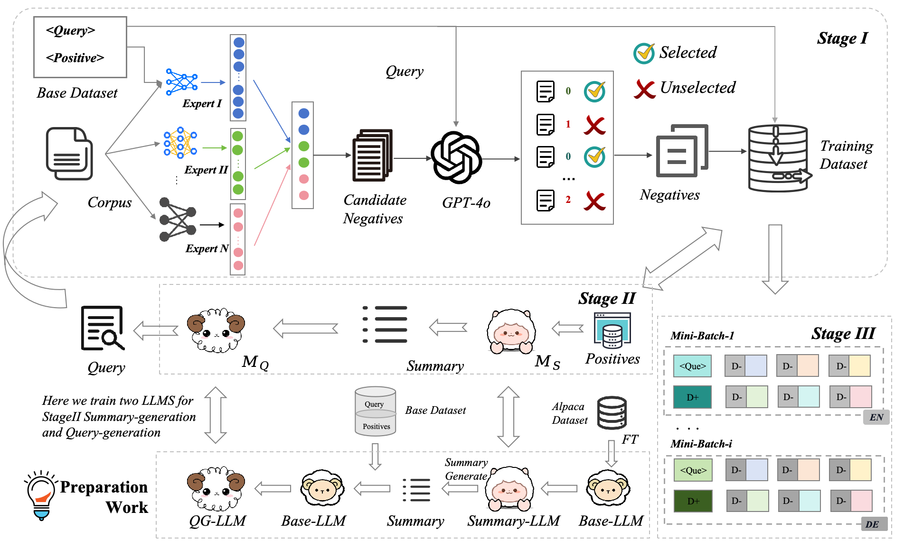

<!--
<div align="center">
  
</div>


# A Data-Driven Framework for Multilingual Dense Retrieval

This repository contains the code and the generated hard negative samples for the paper "A Data-Driven Framework for Multilingual Dense Retrieval".

# 📄 Abstract
Multilingual dense retrieval aims to retrieve relevant documents across multiple languages. The challenge lies in aligning representations of different languages in a shared vector space.The common practice is to fine-tune the dense retriever via contrastive learning, whose effectiveness highly relies on the quality of the negative sample and the construction of mini-batch data. In this study, we propose a data-driven framework DMDR for multilingual dense retrieval fine-tuning by obtaining high-quality hard negative samples and effective mini-batch data and integrating the negative sampling weight with the contrastive learning objective. The extensive experimental results on a multilingual retrieval benchmark MIRACL demonstrate the effectiveness of our proposed DMDR by outperforming several existing strong baselines.

# 🤩 The Framework of DMDR
<div align="center">
  
</div>

Our DMDR framework including three stages: i) construction of hard negative set, ii) LLM-aided hard negative generation, and iii) effective mini-batch construction to facilitate contrastive learning.
-->

# 👉 Quick Start
# Table of Contents:
* [Environment](#environment)
* [Data and Models Preparation](#data-and-models-preparation)
* [Hard Negatives Set Construction](#hard-negatives-set-construction)
  * [Hard Negative Candidate Initialization](#hard-negative-candidate-initialization)
  * [False Negative Selection](#false-negative-selection)
* [LLM-aided hard negative generation](#llm-aided-hard-negative-generation)
* [Train and Evaluation](#train-and-evaluation)

## 1. Environment <a name="environment"></a>
Follow the commands below to establish a plausible environment.
```bash
conda create --name xir python=3.7
conda activate xir
pip install -r requirements.txt
```

## 2. Data and Models Preparation <a name="data-and-models-preparation"></a>

For public datasets and checkpoints can be download from [MIRACL](https://huggingface.co/datasets/miracl/miracl-corpus)、[Alpaca](https://github.com/tatsu-lab/stanford_alpaca)、[mDPR](https://huggingface.co/castorini/mdpr-tied-pft-msmarco)、[mE5<sub>large</sub>](https://huggingface.co/intfloat/multilingual-e5-large) and [BGE](https://huggingface.co/BAAI/bge-m3). And put them in the Data and PLM folders.

## 3. Hard Negatives Set Construction <a name="hard-negatives-set-construction"></a>

### 3.1 Hard Negative Candidate Initialization <a name="hard-negative-candidate-initialization"></a> 

Run the following python script for multilingual retriever ensemble.

```bash
cd Src
python hard_neg/fusion_model.py
```

>**Query Encoding**
```bash
#!/bin/bash

ID=$1
LANG=$2
PARAM=$3

CUDA_VISIBLE_DEVICES=${ID} nohup python -m tevatron.driver.encode \
  --output_dir=temp \
  --model_name_or_path ./PLM/fusion_model \
  --fp16 \
  --per_device_eval_batch_size 156 \
  --data_cache_dir ./msmarco-passage-train-cache \
  --dataset_name Tevatron/msmarco-passage \
  --encode_in_path ./Data/miracl/query/${LANG}.jsonl \
  --encoded_save_path ./Output/query/${LANG}/${LANG}_${PARAM}.pkl \
  --q_max_len 64 \
  --encode_is_qry 
```

>**Corpus Encoding**
```bash
#!/bin/bash

ID=$1
LANG=$2
PARAM=$3

for s in $(seq -f "%02g" 0 5)
do
  CUDA_VISIBLE_DEVICES=${ID} nohup python -m tevatron.driver.encode \
    --output_dir=temp \
    --model_name_or_path ./PLM/fusion_model \
    --fp16 \
    --per_device_eval_batch_size 156 \
    --dataset_name Tevatron/msmarco-passage-corpus \
    --data_cache_dir ./msmarco-passage-train-cache \
    --p_max_len 256 \
    --encode_in_path ./Data/miracl/corpus/${LANG}.jsonl \
    --encoded_save_path ./Output/corpus//${LANG}/${LANG}_${PARAM}.pkl \
    --encode_num_shard 6 \
    --encode_shard_index ${s}
done
```

>**Retrieval**
```bash
#!/bin/bash

LANG=$1
PARAM=$2

nohup python -m tevatron.faiss_retriever \
  --query_reps ./Output/query/${LANG}/${LANG}_${PARAM}.pkl \
  --passage_reps ./Output/corpus/${LANG}/"${LANG}_${PARAM}*.pkl" \
  --depth 40 \
  --batch_size -1 \
  --save_text \
  --save_ranking_to .\Output\rank\/${LANG}/${LANG}_${PARAM}.txt
```
The output file is in the format of <query_id> <passage_id> <score> in each line. 

Then, run the following python script to find the corresponding passage in corpus according to <passage_id>. The candidate negatives will place in the /Output/candidate folder.

```bash
cd Src
python hard_neg/convert.py
```


### 3.2 False Negative Selection <a name="false-negative-selection"></a>

Run the following python script for false negative selection.

```bash
cd Src
python hard_neg/false_neg_select.py
```

The candidate negatives beyond false negatives  will place in the /Output/select folder.

## 4. LLM-aided Hard Negative Generation <a name="llm-aided-hard-negative-generation"></a>

First, run the following python script to select data with less than 30 hard negatives for negatives generation.

```bash
cd Src
python llm_generation/hard_neg_expand.py
```

The data with less than 30 hard negatives will place in the /Output/expand folder.


Then, we finetune Llama-3.1-70B-instruct with the [LLaMA-Factory](https://github.com/hiyouga/LLaMA-Factory) tool to generate hard negative.

>**LLaMA-Factory installation**

Run the following command to quickly install LLaMA-Factory.

```bash
cd ～
git clone --depth 1 https://github.com/hiyouga/LLaMA-Factory.git
cd LLaMA-Factory
pip install -e ".[torch,metrics]"
```

>**Multilingual Instruction Fine-tuning**

First, we use multilingual version of the Alpaca dataset obstained by [Google Translate](https://cloud.google.com/translate/docs/basic/translating-text) for multilingual instruction fine-tuning. The multilingual version of the Alpaca dataset is obtained by running the following script.

```bash
cd Src
python LLM_generation/translate.py
```
 

​Then, replace the yaml file and dataset_info.json in the LLM_generation folder with the corresponding file(examples/train_lora/llama3_lora_sft_ds3.yaml, examples/merge_lora/llama3_lora_sft.yaml, data/dataset_info.json) in the LLaMA-Factory folder. And run the following two commands for LoRA fine-tuning and model merging.

```bash
llamafactory-cli train examples/train_lora/llama3_lora_sft_ds3.yaml
llamafactory-cli export examples/merge_lora/llama3_lora_sft.yaml
```

>**Hard Negative Samples Generation**

First, use the following two scripts to generate summary and query in turn.

```bash
cd Src
python LLM_generation/generate_summary.py
python LLM_generation/generate_query.py
```

The generated summaries and queries will be placed in the /Output/generate/summary and /Output/generate/query folders, respectively. Then, repeat as in section 3, replacing the --encode_in_path in Query Encoding with /Output/generate/query/{lang}.jsonl. Finally, the number of hard negatives for each data is made to reach 30, and will place in the /Data/train_aug folder.

## 5. Train and EvaluationEnvironment <a name="train-and-evaluation"></a>

>**Topic Classification**

Before training the multilingual dense retriver, please use the following python script to add topic labels to each piece of data. This label will be used later in the training. The labeled data will place in the /Data/train_label folder.

```bash
cd Src
python domain_class/domain_classification.py
```

The labeled data will place in the /Data/train_label folder.


>**Tevatron installation**

Then, we use the [tevatron](https://github.com/texttron/tevatron/tree/tevatron-v1) tool for DMDR training. Run the following command for a quick tevatron installation.

```bash
cd src/tevatron
pip install --editable .
```

>**Training**


```bash
CUDA_VISIBLE_DEVICES=0,1 nohup python -m torch.distributed.launch --master_port 22345 --nproc_per_node=2 -m tevatron.driver.train \
  --output_dir ./PLM/mldr_3_6_16_12_8 \
  --do_train \
  --model_name_or_path ./PLM/ \
  --dataset_name Tevatron/msmarco-passage \
  --data_cache_dir ./msmarco-passage-train-cache \
  --train_dir  ./Data/train_label \
  --save_steps 10000 \
  --q_max_len 64 \
  --p_max_len 256 \
  --fp16 \
  --train_n_passages 8 \
  --learning_rate 3e-6 \
  --num_train_epochs 16 \
  --per_device_train_batch_size 12 \
  --overwrite_output_dir \
  --dataloader_num_workers 4 \
  --negatives_x_device > 
```

The query and document lengths are set to 64 and 256, train_n_passages is set to 8, which means that one positive and seven negative samples will be used for each query during training, bacth_size is set to 12, and epochs are set to 16.

>**Encoding**

**Query Encoding**


```bash

#!/bin/bash

ID=$1
LANG=$2
PARAM=$3

CUDA_VISIBLE_DEVICES=${ID} nohup python -m tevatron.driver.encode \
  --output_dir=temp \
  --model_name_or_path ./PLM/mldr_${PARAM} \
  --fp16 \
  --per_device_eval_batch_size 156 \
  --data_cache_dir ./msmarco-passage-train-cache \
  --dataset_name Tevatron/msmarco-passage \
  --encode_in_path ./Data/miracl/query/${LANG}.jsonl \
  --encoded_save_path ./Output/miracl/query/${LANG}_${PARAM}.pkl \
  --q_max_len 64 \
  --encode_is_qry > 
```

**Corpus Encoding**

```bash
#!/bin/bash

ID=$1
LANG=$2
PARAM=$3

for s in $(seq -f "%02g" 0 5)
do
  CUDA_VISIBLE_DEVICES=${ID} nohup python -m tevatron.driver.encode \
    --output_dir=temp \
    --model_name_or_path ./PLM/mldr_${PARAM} \
    --fp16 \
    --per_device_eval_batch_size 156 \
    --dataset_name Tevatron/msmarco-passage-corpus \
    --data_cache_dir ./msmarco-passage-train-cache \
    --p_max_len 256 \
    --encode_in_path ./Data/miracl/corpus/${LANG}.jsonl \
    --encoded_save_path ./Output/miracl/corpus/${LANG}_${PARAM}_${s}.pkl \
    --encode_num_shard 6 \
    --encode_shard_index ${s}
done
```

>**Retrieval**


```bash
#!/bin/bash

LANG=$1
PARAM=$2

nohup python -m tevatron.faiss_retriever \
  --query_reps ./Output/miracl/query/${LANG}/${LANG}_${PARAM}.pkl \
  --passage_reps ./Output/miracl/corpus/${LANG}/"${LANG}_${PARAM}*.pkl" \
  --depth 100 \
  --batch_size -1 \
  --save_text \
  --save_ranking_to ./Output/miracl/rank/${LANG}/${LANG}_${PARAM}.txt
```


>**Evaluation**


  ```bash
  #!/bin/bash
  
  LANG=$1
  PARAM=$2
  
  python -m tevatron.utils.format.convert_result_to_trec \
    --input ./Output/miracl/rank/${LANG}_${PARAM}.txt \
    --output ./Output/miracl/trec/${LANG}_${PARAM}.trec
  
  python -m pyserini.eval.trec_eval \
      -m recall.100 -m ndcg_cut.10 \
      ./Data/miracl/dev/${LANG}.tsv ./Output/miracl/trec/${LANG}_${PARAM}.trec
  ```

# License
This repository is licensed under the [Apache-2.0 License](https://www.apache.org/licenses/LICENSE-2.0).

