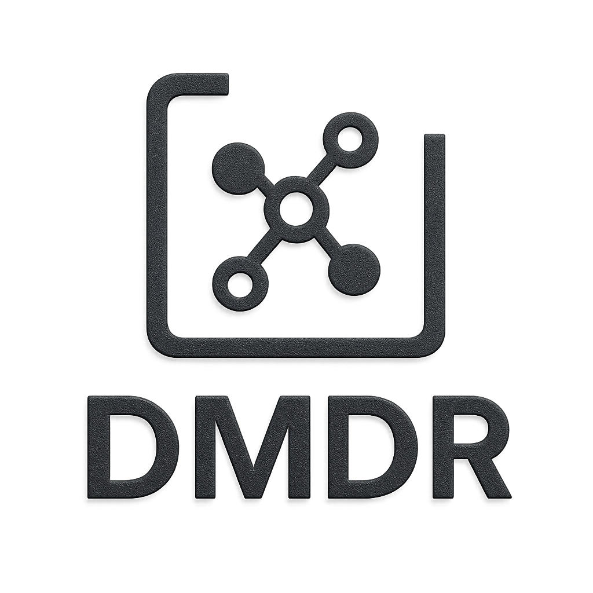

<div style="display: flex; align-items: center;">

<div style="margin-right: 20px; margin-left: -250px; margin-top: -250px;">
    
    <div style="text-align: center; font-size: 24px; font-weight: bold;"></div>
</div>

  <div>
    <h2>A Data-Driven Framework for Multilingual Dense Retrieval</h2>
    <div style="display: flex; gap: 10px; margin-bottom: 10px;">
      <span style="background-color: #f0ad4e; padding: 2px 10px; border-radius: 5px;">Stars: 46k</span>
      <span style="background-color: #5bc0de; padding: 2px 10px; border-radius: 5px;">last commit: today</span>
      <span style="background-color: #d9534f; padding: 2px 10px; border-radius: 5px;">contributors: 162</span>
      <span style="background-color: #5cb85c; padding: 2px 10px; border-radius: 5px;">tests passing</span>
      <span style="background-color: #ff0; padding: 2px 10px; border-radius: 5px;">citation: 929</span>
      <span style="background-color: #5cb85c; padding: 2px 10px; border-radius: 5px;">PRs welcome</span>
    </div>
  </div>

</div>

# A Data-Driven Framework for Multilingual Dense Retrieval

This repository contains the code for the paper "A Data-Driven Framework for Multilingual Dense Retrieval"

# Environment Dependency

Main packages：

Python 3.7

torch 1.10.1

transformers 4.15.0

faiss-gpu 1.7.2

datasets 1.17.0

pyserini 0.22.1

# Running Steps

## 1.Download data and models

For public datasets and checkpoints can be download from [MIRACL](https://huggingface.co/datasets/miracl/miracl-corpus)、[Alpaca](https://github.com/tatsu-lab/stanford_alpaca)、[mDPR](https://huggingface.co/castorini/mdpr-tied-pft-msmarco)、[mE5<sub>large</sub>](https://huggingface.co/intfloat/multilingual-e5-large) and [BGE](https://huggingface.co/BAAI/bge-m3). Then put them in the Data and PLM folders.

## 2.Generate candidate negative samples and false negative sample filtering

Negative sample candidate set generation and false negative sample filtering are performed by running the following commands.

```
cd Src
python hard_neg/candidate_generation.py
python hard_neg/llm_fitering.py
```

## 3.LLM-aided Hard Negative Generation

**LLaMA-Factory installation**

```
git clone --depth 1 https://github.com/hiyouga/LLaMA-Factory.git
cd LLaMA-Factory
pip install -e ".[torch,metrics]"
```

**Multilingual Instruction Fine-tuning**

​Alpaca dataset is an instruction-following data generated by LLaMA and we use it for multilingual 		  instruction fine-tuning. First, run the script to translate the alpaca dataset in multi languages.

```
cd Src
python LLM_generation/translate.py
```

​Then, replace the yaml file in the LLM_generation folder with the corresponding file in the LLaMA-Factory. Then 	run the following two commands for LoRA fine-tuning and model merging

```
llamafactory-cli train examples/train_lora/llama3_lora_sft.yaml
llamafactory-cli export examples/merge_lora/llama3_lora_sft.yaml
```

**Hard Negative Samples Generation**

Use the following two scripts to generate the summary, the query, and the hard negative samples in turn.

```
cd Src
python LLM_generation/inference.py
python hard_neg/candidate_generation.py
```

## 4.Train DMDR

**Tevatron installation**

```
cd src/tevatron
pip install --editable .
```

**Train**

To train DMDR, please run the following commands. 

```
CUDA_VISIBLE_DEVICES=0,1,2,3 nohup python -m torch.distributed.launch --master_port 22345 --nproc_per_node=4 -m tevatron.driver.train \
  --output_dir xxx \
  --do_train \
  --model_name_or_path xxx \
  --dataset_name Tevatron/msmarco-passage \
  --data_cache_dir ./msmarco-passage-train-cache \
  --train_dir xxx \
  --save_steps 10000 \
  --q_max_len 64 \
  --p_max_len 256 \
  --fp16 \
  --train_n_passages 8 \
  --learning_rate 3e-6 \
  --num_train_epochs 16 \
  --per_device_train_batch_size 12 \
  --overwrite_output_dir \
  --dataloader_num_workers 4 \
  --negatives_x_device > 
```


## 5.Evaluation

**Encoding**

To encode query and corpus, use the following two commands, respectively.

```
#!/bin/bash

ID=$1
LANG=$2
PARAM=$3

CUDA_VISIBLE_DEVICES=${ID} nohup python -m tevatron.driver.encode \
  --output_dir=temp \
  --model_name_or_path xxx \
  --fp16 \
  --per_device_eval_batch_size 156 \
  --data_cache_dir ./msmarco-passage-train-cache \
  --dataset_name Tevatron/msmarco-passage \
  --encode_in_path ./DATA/miracl/query/${LANG}.jsonl \
  --encoded_save_path ${LANG}_${PARAM}.pkl \
  --q_max_len 64 \
  --encode_is_qry > 
```


```
#!/bin/bash

ID=$1
LANG=$2
PARAM=$3

for s in $(seq -f "%02g" 0 5)
do
  CUDA_VISIBLE_DEVICES=${ID} nohup python -m tevatron.driver.encode \
    --output_dir=temp \
    --model_name_or_path ./model/mma_model_${PARAM} \
    --fp16 \
    --per_device_eval_batch_size 156 \
    --dataset_name Tevatron/msmarco-passage-corpus \
    --data_cache_dir ./msmarco-passage-train-cache \
    --p_max_len 256 \
    --encode_in_path ./DATA/miracl/corpus/${LANG}.jsonl \
    --encoded_save_path ${LANG}_${PARAM}_${s}.pkl \
    --encode_num_shard 6 \
    --encode_shard_index ${s}
done
```


**Dense Retrieval**

```
#!/bin/bash

LANG=$1
PARAM=$2

nohup python -m tevatron.faiss_retriever \
  --query_reps ${LANG}/${LANG}_${PARAM}.pkl \
  --passage_reps ${LANG}/"${LANG}_${PARAM}*.pkl" \
  --depth 100 \
  --batch_size -1 \
  --save_text \
  --save_ranking_to xxx
```


**Evaluation**

  ```
  #!/bin/bash
  
  LANG=$1
  PARAM=$2
  
  python -m tevatron.utils.format.convert_result_to_trec \
    --input ${LANG}_${PARAM}.txt \
    --output ${LANG}_${PARAM}.trec
  
  python -m pyserini.eval.trec_eval \
      -m recall.100 -m ndcg_cut.10 \
      ${LANG}.tsv ${LANG}_${PARAM}.trec
  ```

  

